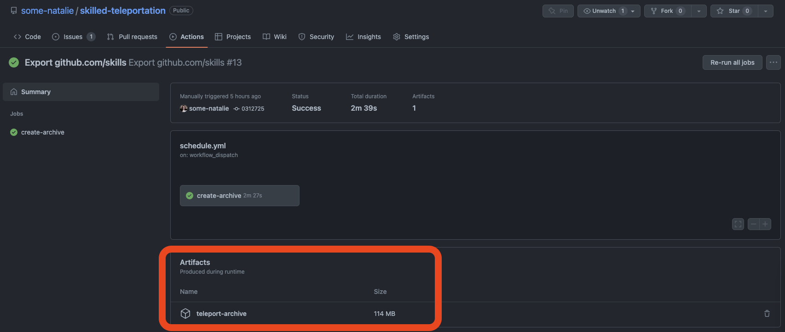

# Skilled Teleportation

Goal - provide sensible defaults to use [actions-sync](https://github.com/actions/actions-sync) on GitHub Enterprise Server when you're stuck with manually syncing Actions from GitHub.com into your server environment due to no network connectivity.

> **Note**
>
> There's a much easier, pain-free, and overall much better way to manage access to Actions using [GitHub Connect](https://docs.github.com/en/enterprise-server@latest/admin/configuration/configuring-github-connect/about-github-connect).

## Directions

You have two paths here, a hard one and a slightly harder one.  Either way, you'll need a personal access token that can create organizations and write to all of the synced organizations (like `actions` or `github` on GHES).

### The hard way

Go to the latest [workflow](https://github.com/some-natalie/skilled-teleportation/actions) and download the latest artifact, like shown below:



The latest version of [actions-sync](https://github.com/actions/actions-sync) is in there, as is the script [`teleport-push.sh`](scripts/teleport-push.sh).  Examine/scan/etc everything in the zip file, fling it to the other side where your GHES instance is, then run the script as follows:

    ```shell
    ./teleport-push.sh teleport-archive.zip "https://github.yourcompany.com" "SOME-GITHUB-TOKEN"
    ```

### The slightly harder way

1. Download [actions-sync](https://github.com/actions/actions-sync) on the machine that pulls from GitHub.com and the machine that pushes into GHES.
1. Create a list of Actions to sync over.  This Action just pulls over everything in [github.com/skills](https://github.com/skills), plus dependencies defined in [`skills-dependencies.txt`](skills-dependencies.txt) and anything extra in [`extra-actions.txt`](scripts/extra-actions.txt).  You can use the [`teleport-pull.sh`](scripts/teleport-pull.sh) script to do this if you'd like.
1. Tarball the whole thing up.
1. Untar it on the other side, then push the Actions into GHES.  You can use the [`teleport-push.sh`](scripts/teleport-push.sh) script to do this if you'd like.
1. If needed, change each repo that needs to be a template (such as the Skills repositories).

## But why though?

There's a couple reasons.

1. [skills.github.com](https://skills.github.com) is cool and, if you have self-hosted Actions runners with the `ubuntu-latest` label and the appropriate software installed on them, your on-premises users can have some neat self-paced training too.
1. Provide some sensible defaults to what can/should be synced from GitHub.com into your GHES installation.
1. Provide a framework to add more things to sync over.
1. I wanted to pick apart on-premises Actions without using GitHub Connect a little bit more.
1. Highlight how much easier this is using [GitHub Connect](https://docs.github.com/en/enterprise-server@latest/admin/configuration/configuring-github-connect/about-github-connect) instead. :heart:

## CodeQL

Don't use this for syncing CodeQL.  There's another tool specifically for that called [codeql-action-sync-tool](https://github.com/github/codeql-action-sync-tool).  It's not included in this Action by default because it also grabs the binary assets for CodeQL which adds a couple GBs to the archive.
